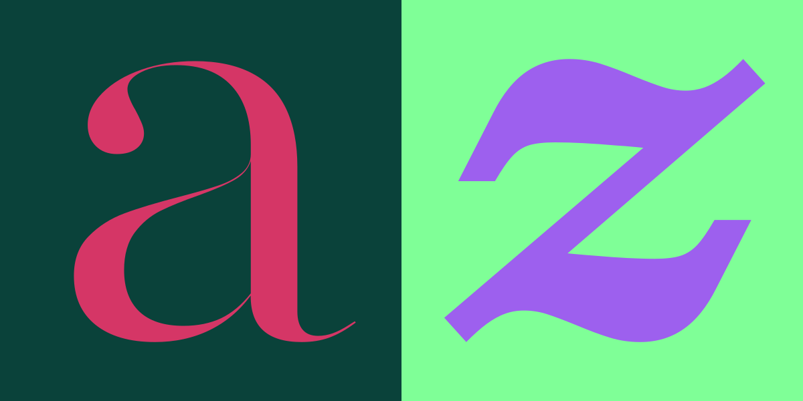
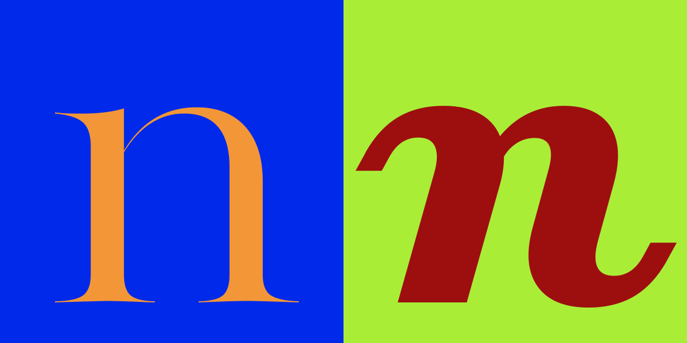

<!------>

**Playfair 2.0** is stylistically a *trans­itional* design. From the time of enlight­en­ment in the late 18th cen­tury, the broad nib quills were replaced by poin­ted steel pens. This influ­enced typo­graph­ical let­ter­forms to become increas­ingly detached from the writ­ten ones. Devel­op­ments in print­ing tech­no­logy, ink, and paper mak­ing made it pos­sible to print let­ter­forms of high con­trast and del­ic­ate hairlines.

This design lends itself to this *trans­itional* period, and while it is not a revival of any par­tic­u­lar design, it takes influ­ence from the Caslon foundry type, the designs of printer and typeface designer John Bask­erville, the punch­cut­ter Wil­liam Martin’s typeface for the ‘Boy­dell Shak­speare’ (sic) edi­tion, and from the ‘Scotch Roman’ designs that fol­lowed thereafter.


<!------>

**Playfair 2.0** is well suited for general purpose typesetting. It has an extra large x-height and short des­cend­ers. Because it is now a *variable font,* you the designer can seamlessly interpolate Playfair in three dimensions:
- *Widths* from Semi-Condensed to Semi-Expanded
- *Weights* from Normal to Black
- *Optical sizes* from Agate to Needlepoint

**Playfair 2.0** supports both the Latin and Cyrillic scripts with a glyph complement for the most used languages using these scripts.


<!------>

**Playfair 2.0** has been designed with context-dependant alternate designs of some glyphs. These alternates are automatically applied based on the *optical size, the width, and the weight* of the text.

Besides the default *old-style* numerals, **Playfair 2.0** also includes lining numerals, scientific inferiors, numerators, denominators, pre-composed fractions, and arbitrary fractions.

**Playfair 2.0** Contains several *stylistic alternate* letterforms so that you the designer can change how your text appears to the world.

**Playfair 2.0** Includes Small-Caps.

**Playfair 2.0** includes a full set of small-caps, common lig­at­ures, rare ligatures including *ſ,* and dis­cre­tion­ary lig­at­ures.
- Pol­ish altern­ate *kreska* forms are included.
- Catalan *punt volat* is supported.
- Dutch *IJ* and *ij* is supported.
- Case-transformation of Turkic languages is supported.
- Icelandic and Faroese *fð* and *fþ* ligatures included. 
- Romanian *comma accents* are supported.
- *Serbian Cyrillic* letterforms are included.
- Vietnamese double-stacked diacritical marks are included.
- Special design of the *її* combination for Ukrainian is included.
- Mark-to-mark positioning and composition of diacritical marks is supported.


<!------>

<!---
Go to **[Google Web­fonts to use Play­fair 2.0 as a web­font](http://www.google.com/fonts/specimen/Playfair2)**.
--->

**Playfair 2.0** is pub­lished under the [SIL Open Font License Version 1.1](https://github.com/clauseggers/Playfair-Display/blob/master/OFL.txt), grant­ing you license to use the fonts free of charge, and enables you to extend & modify the fam­ily should you wish to. The com­plete source-files are avail­able in this repository.

## Supported languages

**Playfair 2.0 supports the following languages**
Afrikaans, Albanian, Asu, Basque, Belarusian, Bemba, Bena, Bosnian, Bulgarian, Catalan, Chiga, Congo Swahili, Cornish, Croatian, Czech, Danish, Embu, English, Esperanto, Estonian, Faroese, Filipino, Finnish, French, Galician, Ganda, German, Gusii, Hungarian, Icelandic, Indonesian, Irish, Italian, Jola-Fonyi, Kabuverdianu, Kalaallisut, Kalenjin, Kamba, Kikuyu, Kinyarwanda, Latvian, Lithuanian, Luo, Luyia, Macedonian, Machame, Makhuwa-Meetto, Makonde, Malagasy, Malay, Maltese, Manx, Meru, Morisyen, North Ndebele, Norwegian Bokmål, Norwegian Nynorsk, Nyankole, Oromo, Polish, Portuguese, Romanian, Romansh, Rombo, Rundi, Russian, Rwa, Samburu, Sango, Sangu, Sena, Serbian, Shambala, Shona, Slovak, Slovenian, Soga, Somali, Spanish, Swahili, Swedish, Swiss German, Taita, Teso, Turkmen, Vunjo, Welsh, and Zulu.


<!------>

**Playfair 2.0** is designed by **[Claus Eggers Sørensen](http://forthehearts.net/)** in 2005–2022, and is published under the [SIL Open Font License Version 1.1](https://github.com/clauseggers/Playfair-Display/blob/master/OFL.txt).

## Building TTFs for Google Fonts

The GoogleFonts version has different vertical metrics.

To generate the fonts run

```
$ python sources/generate_gf_version.py
```
